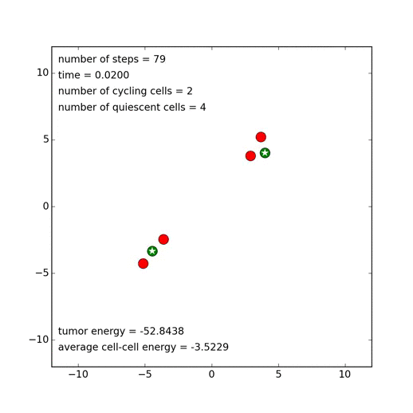

tumor
======
Agent-based spatial and stochastic model of tumor growth by [Peter McHale](http://ccbs-76.bio.uci.edu/~petermchale/). The accompanying [Jupyter Notebook](https://nbviewer.jupyter.org/github/petermchale/tumor/blob/master/demonstration.ipynb?flush_cache=true) illustrates how to 
* simulate the model in Python 3.x
* statistically analyze data generated by the model
* visualize the results of the analysis to maximize insight


In the movie above, there are two types of cells - those that replicate ('cycle' in biological terms) and those that do not (called 'quiescent' by biologists). To run this movie on your own computer, download this repository, open `Terminal` (on a Mac), navigate to the repository, and execute the following commands at the command line:
```
cd data
python ../tumor_package/animate.py
````
Performance optimizations
=========================
